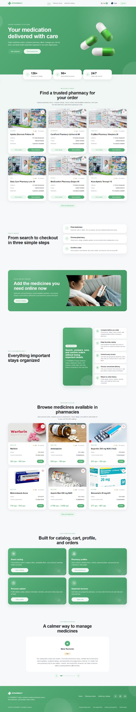
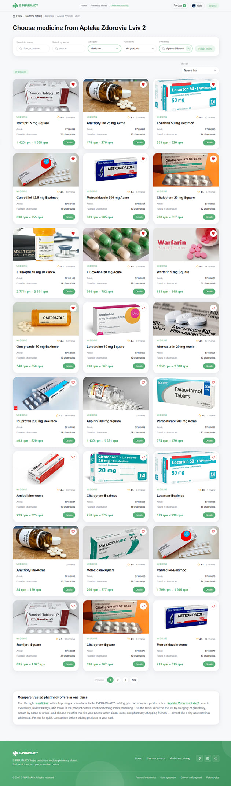
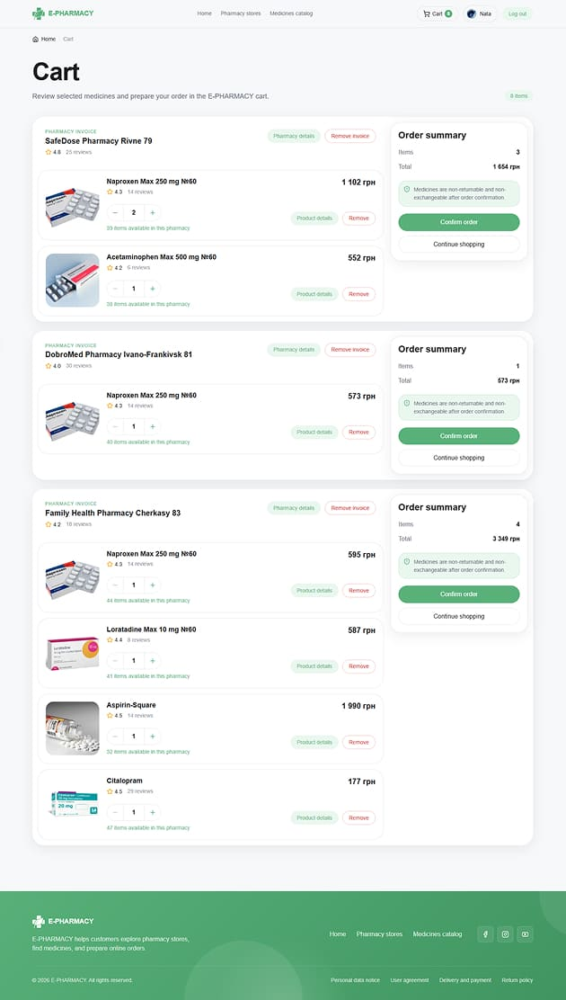
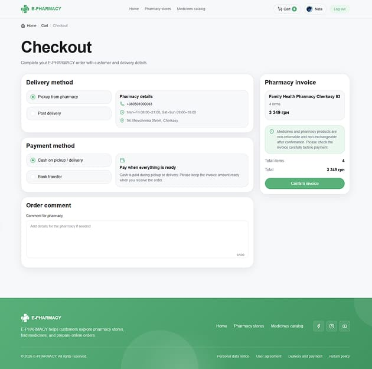

# E-PHARMACY

E-PHARMACY is a full-stack e-commerce project for an online pharmacy. The project is organized as a monorepo with a client storefront, a shared backend API, shared workspace packages, and planned app boundaries for pharmacy and admin panels.

## Live Demo

- **Client:** https://e-pharmacy-client-ten.vercel.app
- **API:** https://e-pharmacy-api-pbaz.onrender.com

## Current Status

Implemented:

- `apps/client` — client storefront
- `apps/api` — shared Express/MongoDB API
- `packages/*` — shared types, utilities, validation, config, and small UI contracts

Planned:

- `apps/pharmacy` — pharmacy/pharmacy cabinet
- `apps/admin` — admin dashboard

Pharmacy and admin folders are kept as planned app boundaries. They are not completed applications yet.

## Main Features

### Client storefront

- Home page and public information pages
- Pharmacies catalog with search, filters, sorting, pagination, details, reviews, and favorites
- Product catalog with search, filters, sorting, pagination, product details, reviews, and favorites
- Cart grouped by pharmacy order
- Checkout with pickup/postal delivery details and client comment
- Client profile, password update, order history, and order details
- Password recovery through email reset flow
- Loading, empty, error, success, not-found, and protected-route states

### Backend API

- Auth with JWT and backend-managed httpOnly cookies
- User profile and password management
- Products, pharmacies, reviews, favorites, cart, and orders
- MongoDB/Mongoose data models
- Zod validation
- Centralized error handling
- Rate limiting, Helmet, CORS, and Origin/Referer validation for cookie-based mutations
- Role middleware foundation for future pharmacy/admin work

### SEO and routing

- Dynamic metadata for public pages
- Canonical URLs for catalog and detail pages
- Root-level product and pharmacy detail URLs
- Dynamic sitemap and robots rules
- Noindex rules for private, auth, service, search, sorting, pagination, and temporary catalog states
- Breadcrumbs generated from route data

## Screenshots

| Home                                                    | Product catalog                                                     | Product details                                                       |
| ------------------------------------------------------- | ------------------------------------------------------------------- | --------------------------------------------------------------------- |
|  |  |  |

| Pharmacy catalog                                                      | Cart                                                    | Order confirmation                                                                  |
| --------------------------------------------------------------------- | ------------------------------------------------------- | ----------------------------------------------------------------------------------- |
|  |  |  |

## Tech Stack

### Frontend

- Next.js 16
- React 19
- TypeScript
- CSS Modules
- Lucide React
- clsx

### Backend

- Node.js
- Express
- TypeScript
- MongoDB
- Mongoose
- Zod
- Nodemailer
- Handlebars

### Tooling

- pnpm workspaces
- Turborepo
- ESLint
- Prettier

## Project Structure

```txt
apps/
  client/   # client storefront
  api/      # shared backend API
  pharmacy/   # planned pharmacy cabinet
  admin/    # planned admin dashboard

packages/
  api-client/
  config/
  types/
  ui/
  utils/
  validation/
```

## Shared Packages

Current shared packages are intentionally small and are used where reuse already makes sense.

- `@e-pharmacy/api-client` — HTTP contracts and normalization of external API responses, including strict pagination parsing
- `@e-pharmacy/config` — shared application configuration, route builders, navigation values, and product presentation options
- `@e-pharmacy/types` — shared TypeScript domain and API contract types
- `@e-pharmacy/ui` — reusable React components and UI-only helpers
- `@e-pharmacy/utils` — pure environment-independent utilities for money, dates, numbers, strings, collections, and type guards
- `@e-pharmacy/validation` — frontend validation contracts, canonical domain parsers, normalizers, limits, and patterns

Dependency rules:

- `packages/utils` must not depend on React, Next.js, browser globals, API transport, or application code.
- API response parsing belongs to `packages/api-client`; route configuration belongs to `packages/config`.
- Canonical working-hours parsing belongs to `packages/validation/pharmacy`.
- Backend-only helpers remain inside `apps/api` and must not import workspace packages.

## Environment Variables

Use app-level examples as the source of truth:

```txt
apps/client/.env.example
apps/api/.env.example
```

Main local values:

```env
# apps/client
NEXT_PUBLIC_SITE_URL=http://localhost:3000
API_BASE_URL=http://localhost:4000
BFF_PROXY_SECRET=

# apps/api
NODE_ENV=development
PORT=4000
MONGODB_URI=mongodb+srv://...
JWT_SECRET=...
CLIENT_ORIGINS=http://localhost:3000
CLIENT_APP_URL=http://localhost:3000
AUTH_COOKIE_SAME_SITE=lax
```

## Run Locally

Install dependencies:

```bash
git clone https://github.com/Natalia-Skoropad/e-pharmacy
cd e-pharmacy
pnpm install
```

Create env files:

```txt
apps/client/.env.local
apps/api/.env
```

Run the API:

```bash
pnpm dev:api
```

Run the client:

```bash
pnpm dev:client
```

Seed the database when needed:

```bash
pnpm seed:api
```

## Quality Checks

```bash
pnpm lint
pnpm type-check
pnpm build
```

Useful scoped checks:

```bash
pnpm check:client
pnpm check:api
```

## Implementation Notes

The strongest completed parts of the project are the client storefront, backend API, SEO routing, cookie-based auth flow, cart/checkout/order logic, and shared monorepo structure.

Pharmacy and admin apps are planned ecosystem extensions, not completed modules yet.

## Canonical cart, stock, and order rules

- Stock is stored only on `ProductOffer` as `totalQuantity`, `availableQuantity`, and `reservedQuantity`.
- The invariant is `totalQuantity = availableQuantity + reservedQuantity`; availability is derived from `availableQuantity > 0`.
- One Client User has one multi-pharmacy Cart. Each pharmacy group creates one separate Order.
- A Cart may contain products from no more than 15 pharmacies to prevent accidental creation of an excessive number of orders. The client should confirm existing groups before adding another pharmacy.
- Cart items reference `ProductOffer` and display its current price. Price becomes immutable only when an Order is confirmed.
- Order stock stays reserved while the Order is `new` or `in_progress`; it is committed on `successful` and released on `rejected`.
- Canonical types are `PaymentMethod` and `DeliveryMethod`; postal delivery uses `postal_delivery`.
- Product categories come from the shared `PRODUCT_CATEGORIES` constant.
