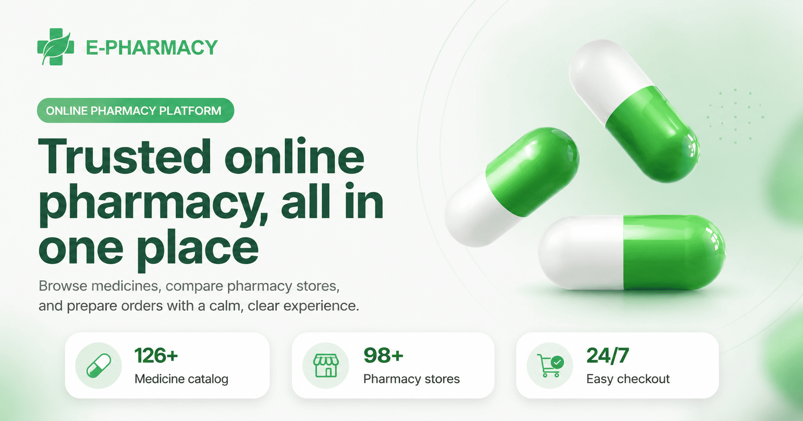
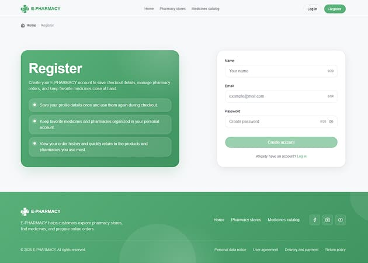
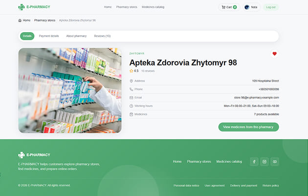
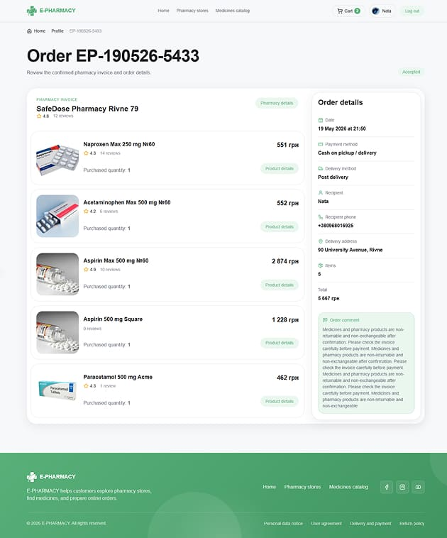
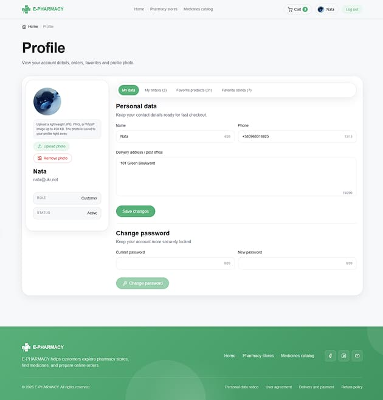
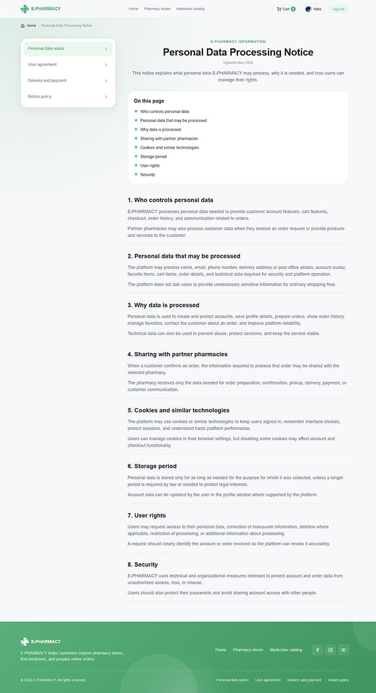
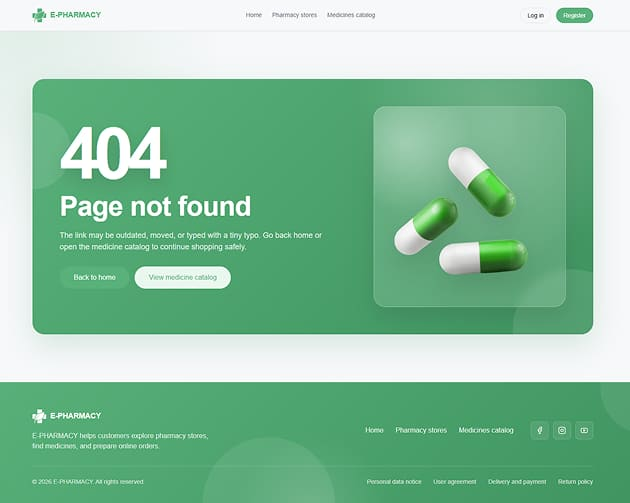

# E-PHARMACY Client

> A responsive client storefront for browsing pharmacies, finding products, managing a cart, and creating online orders.



## Overview

**E-PHARMACY Client** is the client-facing application of the E-PHARMACY monorepo.

The client app allows clients to:

- browse pharmacies
- search, filter, and sort products
- open detailed product and pharmacy pages with SEO-friendly URLs
- add products and pharmacies to favorites
- manage cart items grouped by pharmacy
- complete checkout with pickup or delivery details
- view profile information and confirmed orders
- read and submit product or pharmacy reviews

The application focuses on a clean client experience, responsive layout, reusable UI components, route-driven SEO, and integration with a shared backend API.

> Current status: the client storefront is implemented. Pharmacy and admin applications are separate parts of the monorepo and are described in their own README files.

## Live Demo

```txt
https://e-pharmacy-client-ten.vercel.app
```

## Screenshots

### Home page


### Registration page



### Pharmacy catalog


### Pharmacy details page



### Product catalog


### Product details page


### Cart page


### Order confirmation page


### Order details page



### Profile page



### Information page



### 404 page



## Features

### Authentication

- client registration and login
- logout with session cleanup
- current user loading
- protected client routes
- guest-only auth pages
- password recovery through email reset flow
- profile editing
- password changing

### Pharmacies

- public pharmacy catalog
- search by pharmacy name and address
- city filtering
- sorting and pagination
- pharmacy details pages
- pharmacy reviews
- favorite pharmacy toggle for authenticated users
- responsive pharmacy cards

### Product catalog

- public product catalog
- search by product name and article
- category filtering
- pharmacy filtering
- availability filtering
- sorting by rating and name
- pagination
- product details pages
- product characteristics and reviews
- favorite product toggle for authenticated users

### Cart and checkout

- adding products to cart
- cart grouped by pharmacy
- quantity controls with stock limits
- order-level summaries
- checkout with pickup or postal delivery
- order creation through the backend API
- delivery address and client comment in order details

### Profile and orders

- client profile page
- editable profile data
- password changing flow
- order history
- detailed order page with pharmacy, products, delivery method, address, comment, and totals

### SEO and routing

- public indexable routes for home, catalogs, detail pages, and information pages
- clean URLs for product and pharmacy detail pages
- legacy redirects to canonical detail URLs
- dynamic page titles and meta descriptions
- canonical URLs
- Open Graph metadata
- Twitter card metadata
- dynamic sitemap generation
- robots rules for private/auth/service routes
- noindex logic for private pages and low-value catalog states
- breadcrumbs generated from route data
- semantic page structure with one clear `h1` per page
- dedicated not-found and error pages

### UX and interface

- responsive layout for mobile, tablet, and desktop
- shared header, mobile menu, footer, breadcrumbs, buttons, modals, tabs, forms, toasts, and status pages
- shimmer image placeholders
- loading, empty, success, error, and not-found states
- reusable filters and search controls
- accessible modal and offcanvas behavior

## Tech Stack

### Frontend

- **Next.js 16**
- **React 19**
- **TypeScript**
- **CSS Modules**

### UI and utilities

- **Lucide React**
- **clsx**
- shared UI contracts
- shared internal utilities package

### Data and backend integration

- shared Express/MongoDB backend API
- Next.js same-origin BFF route handlers for private client flows
- shared API response contracts
- shared TypeScript generic types
- shared validation constants and sanitizers

### Monorepo tooling

- **pnpm workspaces**
- **Turborepo**
- shared configuration package

## Project Structure

```txt
apps/client/
  public/
    icons/
    og/
    readme/
  src/
    app/
      (private)/
        layout.tsx
        cart/
        checkout/[slugId]/
        profile/
          orders/[orderId]/
      (public)/
        (auth)/
          (guest)/
            layout.tsx
            login/
            register/
            password-recovery/
          reset-password/
        (info)/
          delivery-and-payment/
          personal-data-notice/
          return-policy/
          user-agreement/
        (products)/
          product-catalog/[[...segments]]
          products/[slugId]/
        (pharmacies)/
          pharmacies/[[...segments]]
          pharmacies/[slugId]/
        [slugId]/
      api/
        auth/
        cart/
        orders/
        products/
        pharmacies/
        health/
      error.tsx
      layout.tsx
      loading.tsx
      not-found.tsx
      page.tsx
      robots.ts
      sitemap.ts
    components/
      auth/
      cart/
      checkout/
      common/
      form-fields/
      home/
      info/
      layout/
      product-catalog/
      modals/
      pharmacies/
      profile/
    hooks/
    lib/
      api/
        browser/
        proxy/
        routes/
        server/
      auth/
      cart/
      catalog/
      checkout/
      constants/
      details/
        server/
      errors/
      routes/
      seo/
    providers/
    routes/
```

## Main Pages

### Home

A public landing page that introduces the service, explains the client flow, and guides users to pharmacies and products.

### Authentication pages

Registration, login, password recovery, and reset-password pages with validation, user-friendly states, and redirect protection.

### Pharmacies

A public catalog for browsing pharmacies with search, city filtering, sorting, pagination, favorite actions, reviews, and detail pages.

### Product catalog

A public catalog for browsing products with search, filters, sorting, pagination, product cards, reviews, and detailed product pages.

### Cart

A private client page where products are grouped by pharmacy with stock-aware quantity controls and order summaries.

### Checkout

A private confirmation flow for creating orders with delivery method selection, client contact data, address, comment, and backend order saving.

### Profile

A private client account page for profile editing, password changing, and reviewing previous orders.

### Information pages

Public pages for delivery and payment, return policy, user agreement, and personal data notice.

## SEO Details

The client app has a dedicated SEO layer for public pages. The goal is to keep useful client pages indexable, avoid duplicate catalog URLs, and prevent private or low-value states from entering search results.

### SEO architecture

```txt
src/lib/seo/metadata.ts             -> site name, default metadata, OG image
src/lib/seo/sitemap.ts              -> sitemap routes and dynamic sitemap helpers
src/lib/seo/robots.ts               -> robots rules
src/lib/seo/create-page-metadata.ts -> shared metadata builder
src/lib/seo/url.ts                  -> absolute URL helper based on CLIENT_ENV.siteUrl
src/app/sitemap.ts                  -> dynamic sitemap generation
src/app/robots.ts                   -> robots.txt rules
src/lib/catalog/*                   -> catalog URL, canonical, title, description, noindex logic
src/lib/details/server/*            -> product/pharmacy detail metadata and canonical resolver
```

### Public indexable routes

```txt
/
/pharmacies
/product-catalog
/delivery-and-payment
/return-policy
/user-agreement
/personal-data-notice
/{product-name}-{productId}
/{pharmacy-name}-{pharmacyId}
```

Dynamic product and pharmacy detail pages are included in the sitemap when the API returns valid active data.

### Routes excluded from indexing

```txt
/cart
/checkout
/checkout/*
/profile
/profile/*
/login
/register
/password-recovery
/reset-password
/admin
/admin/*
/pharmacy
/pharmacy/*
error pages
not-found pages
```

This prevents client account data, checkout states, auth pages, and future private dashboards from appearing in search results.

### Product and pharmacy detail routes

Each product and pharmacy has a clean root-level URL:

```txt
/paracetamol-max-500-mg-60-6a01bcd0b2ed6525cedea937
/wellness-hub-pharmacy-chernihiv-91-6a01bcd0b2ed6525cedea940
```

Legacy paths are still supported, but they redirect permanently to the canonical URL:

```txt
/products/[slugId]    -> /[slugId]
/pharmacies/[slugId]  -> /[slugId]
```

If a user opens a detail page with an outdated or incorrect slug, the app resolves the entity by id and redirects to the canonical slug. If the entity does not exist, the page returns the not-found state and noindex metadata.

### Catalog routing

The product catalog supports readable route segments for meaningful primary filters:

```txt
/product-catalog
/product-catalog/category-antibiotics
/product-catalog/pharmacy-wellness-hub-pharmacy-6a01bcd0b2ed6525cedea940
/product-catalog/category-antibiotics/pharmacy-wellness-hub-pharmacy-6a01bcd0b2ed6525cedea940
```

Search, article search, availability, sorting, and pagination are treated as temporary catalog states and are marked as non-indexable when needed.

The pharmacy catalog also uses readable route segments:

```txt
/pharmacies
/pharmacies/city-kyiv
/pharmacies/search-name-health
/pharmacies/address-main-street
/pharmacies/sort-rating-desc
/pharmacies/page-2
```

City pages can be indexable because they describe stable location-based catalog content. Search by name/address, sorting, pagination, and empty-result states are noindex to avoid thin or duplicate pages.

### Sitemap and robots

`sitemap.ts` generates static public pages and active product/pharmacy detail pages from the API. `robots.ts` allows public pages and disallows private/auth/dashboard paths while pointing crawlers to `/sitemap.xml`.

## API Integration

The client communicates with the shared backend API from `apps/api` through two paths:

```txt
Public/server data -> Express API -> MongoDB
Browser private flow -> Next.js same-origin /api/* route handlers -> Express API -> MongoDB
```

Public catalog data, SEO metadata, sitemap data, and read-only pages can be loaded server-side from the backend API.

Auth, cart, checkout, orders, profile updates, password updates, review/favorite mutations, and other client-only mutations go through the Next.js BFF route handlers under `apps/client/src/app/api/*`.

This BFF layer keeps browser requests same-origin and forwards only the required auth cookies. The Next.js BFF is the sole owner of browser auth cookies: backend `Set-Cookie` headers are intentionally not copied. The backend remains the source of truth for access and session validation.

The client-readable `e_pharmacy_auth_ready` cookie is only a UX/session marker for redirects and auth bootstrap. It is not a security token and does not authorize backend data access.

### Lifecycle ownership map

| Layer | Owner | Identity / concurrency policy |
| --- | --- | --- |
| Auth capability | `selectClientAuthCapabilities` + `useClientAuthCapabilities` | Pure selector stays separate from the React adapter |
| Session lifecycle | `ClientSessionScopeProvider` | Every authenticated, unavailable, logout, account-switch, and same-user relogin lifecycle receives a new owner key |
| Favorites | `FavoritesProvider` | Product/pharmacy ID sets are single-flight, session-keyed, abortable, and updated by one mutation owner |
| Reviews | `useReviewForm` | Ephemeral draft keyed by session owner and `product:*` or `pharmacy:*` target |
| Cart | `CartProvider` | Discriminated read state, one serialized mutation queue, session cancellation, retry/refresh |
| Route access | `ClientProtectedRoute` / `ClientGuestOnlyRoute` | Client-specific UX boundary; backend remains the security boundary |

App-specific lifecycle hooks remain in `apps/client`; `packages/hooks` contains only environment-agnostic infrastructure. Source-pattern checks are architecture lint only. Behavioral coverage lives in pure controller/store tests plus the React provider-stack render test.

### Client architecture boundaries

- Browser API helpers live in `src/lib/api/browser` and are marked as client-only. They are low-level same-origin BFF request wrappers and should not be imported by server components, metadata helpers, sitemap, robots, or server route handlers.
- Server reads for catalog, SEO, sitemap, robots, and detail metadata use `src/lib/api/server`. Proxy route handlers use `src/lib/api/proxy`.
- `CartProvider` is the single cart read/write controller in the browser. It owns the cart state machine, one serialized mutation queue, pending item/offer state, retry/refresh commands, and authoritative server commits. Components do not call cart mutation API helpers directly.
- Cart state is keyed by the shared client session generation and is destroyed on logout, account switch, blocked/unavailable auth transitions, and same-user relogin. Cancelled or stale reads return `null`; they are never represented as a valid empty cart.
- Quantity updates are optimistic inside the serialized queue. Add/remove/clear operations are server-authoritative. Multi-item pharmacy removal refreshes the cart after partial failure and reports a structured partial-mutation error.
- `FavoritesProvider` owns product and pharmacy favorite ID collections. Collection reads are single-flight per session owner, mutations are abortable, and cards never issue one favorite-ID request per item.
- Auth route guards in `src/routes` are client-specific wrappers around the shared auth guards. The private route-group layout requires an active client capability, while login, registration, and password recovery inherit one guest-preferred layout. Reset-password remains a token route and is not guest-only.
- Product and pharmacy detail server composition lives under `src/lib/details/server` and is exported through a server-only details barrel.
- Storefront route builders live in `src/lib/routes`. Product, pharmacy, checkout, and order paths should not be recreated in feature modules.
- Review form state stays in client hooks, while validation rules come from the shared validation package. Drafts and submissions are keyed by the shared session generation plus the review target, and obsolete submissions are aborted.

Main API areas used by the client:

- auth: register, login, current user, profile update, password update, password reset, logout
- pharmacies: catalog, filters, details, reviews, favorites
- products: catalog, filters, details, reviews, favorites
- cart: get cart, add/update/remove item, clear cart
- orders: checkout, order history, order details

## Performance Notes

- Public catalog pages are rendered on the server and use cached/revalidated public API reads.
- `apps/client/src/lib/api/server/cache-options.ts` centralizes public API revalidation settings.
- `packages/next-api` provides the shared public/private/optional-auth/auth proxy factories, cache policy, security checks, and auth-cookie handling.
- Remote image patterns are configured in `next.config.ts` for deployed backend image assets.
- Seed product and pharmacy images are client-owned runtime assets under `public/images/seed/**`; backend seed DTOs return same-origin relative paths for this portfolio deployment.
- CSS Modules keep component styling scoped.
- `AuthProvider` uses `bootstrapMode="always"`; the client-readable marker is not a source of truth. A shared client session generation scopes cart, favorites, and review drafts across logout and relogin transitions.

## Environment Variables

Create an `.env.local` file inside `apps/client`. The source of truth for client keys is `apps/client/.env.example`.

```env
NEXT_PUBLIC_SITE_URL=http://localhost:3000
NEXT_PUBLIC_PHARMACY_APP_URL=http://localhost:3002
API_BASE_URL=http://localhost:4000
BFF_PROXY_SECRET=
```

### Variable reference

| Variable | Used for | Example |
| --- | --- | --- |
| `NEXT_PUBLIC_SITE_URL` | canonical URLs, metadata, sitemap, robots, absolute public URLs | `http://localhost:3000` |
| `NEXT_PUBLIC_PHARMACY_APP_URL` | pharmacy application base URL used for trusted cross-application redirects | `http://localhost:3002` |
| `API_BASE_URL` | backend URL used only by Next.js server-side data fetches and BFF route handlers | `http://localhost:4000` |
| `BFF_PROXY_SECRET` | optional shared secret sent by Next.js BFF handlers to the Express API | `local-secret` |

For production, replace these values with the deployed client, pharmacy, and API URLs. `NEXT_PUBLIC_PHARMACY_APP_URL` must be an HTTPS application base URL without credentials, query, hash, or the client origin. A configured base path is preserved when `/pharmacy/dashboard` is appended. Invalid production configuration is shown as a controlled application error and never falls back silently to the client home page. `NEXT_PUBLIC_SITE_URL` is required for real production deploys so sitemap, robots, canonical URLs, and social metadata do not fall back to localhost. Local builds may use the localhost fallback when this variable is not set.

For production, set the same `BFF_PROXY_SECRET` value in the client app and API app when the API enforces BFF proxy authentication.

Client-side private flows should continue to call same-origin `/api/*` routes, while those route handlers use server-only `API_BASE_URL` to reach the backend.

The browser should not call private backend mutations directly. Auth, cart, checkout, orders, profile updates, password updates, review/favorite mutations, and logout should keep using the same-origin BFF route handlers.

## Getting Started

```bash
git clone https://github.com/Natalia-Skoropad/e-pharmacy
cd e-pharmacy
pnpm install
```

Create `apps/client/.env.local` and add the required variables.

Start the client app:

```bash
pnpm dev:client
```

Open the app:

```txt
http://localhost:3000
```

## Available Scripts

From the monorepo root:

```bash
pnpm dev:client
pnpm build:client
pnpm lint:client
pnpm type-check:client
pnpm --filter @e-pharmacy/client test:react
pnpm --filter @e-pharmacy/client test:integration
pnpm check:client
```

From `apps/client`:

```bash
pnpm dev
pnpm build
pnpm start
pnpm lint
pnpm type-check
pnpm test
pnpm test:react
pnpm test:integration
```

Test layers:

- `test` runs pure selectors, state machines, stores, route/config decisions, and API-reader contracts.
- `test:react` renders the real `ClientProviders` stack with React and verifies that application content is mounted inside the required provider order.
- `test:integration` covers cart serialization/partial-failure recovery and cross-application auth redirect configuration.
- `check:client-hooks`, `check:client-providers`, `check:client-routes`, `check:client-user-state`, `check:client-cart`, and `check:client-noop-wrappers` are architecture checks included in `check:before-deploy`.

## Security Notes

- Client-side browser API helpers and the provider-owned cart controller call same-origin `/api/*` route handlers instead of writing directly to the external backend URL.
- Auth tokens are not stored in `localStorage`; the real auth session is represented by backend-managed httpOnly cookies.
- The client-readable `e_pharmacy_auth_ready` cookie is only a UX/session marker and is not used to authorize backend data access.
- `ClientProtectedRoute` and `ClientGuestOnlyRoute` improve navigation UX, while real authorization stays on the backend. Private routes require an active client account, not merely the `client` role.
- Private pages are marked noindex and are excluded from sitemap generation.

## Deployment Notes

Before deploying the client, run:

```bash
pnpm check:client
```

Recommended production checklist:

- set production `NEXT_PUBLIC_SITE_URL`
- set a valid HTTPS `NEXT_PUBLIC_PHARMACY_APP_URL` that does not reuse the client origin
- set production `API_BASE_URL`
- verify API CORS, cookie, and Origin/Referer settings
- verify private auth/cart/order/review/favorite flows go through same-origin `/api/*` route handlers
- verify sitemap and robots rules
- confirm private routes are not indexed
- confirm checkout and order creation work with the deployed API

## Highlights

- full client storefront flow from catalog discovery to confirmed order
- clean monorepo architecture with shared workspace packages
- SEO-friendly routing for catalogs and detail pages
- reusable UI system with consistent buttons, cards, modals, tabs, toasts, and forms
- responsive design across mobile, tablet, and desktop
- backend-powered cart and order flow through a Next.js BFF layer
- httpOnly cookie auth without browser-stored tokens
- thoughtful empty, loading, error, success, and not-found states

## Author

**Nataliia Skoropad**  
Full-stack Developer  
Backend development, Frontend development, UI/UX design

## Cart and checkout domain rules

- The Cart can group ProductOffers from up to 15 pharmacies; each pharmacy group is confirmed as a separate Order.
- The limit prevents accidental creation of too many Orders. Confirm existing pharmacy groups before adding products from another pharmacy.
- ProductOffer prices remain live while products are in the Cart and update on the next Cart response. Price is frozen only in the confirmed Order.
- Canonical checkout types are `PaymentMethod` and `DeliveryMethod`; postal delivery is `postal_delivery`.
- Favorites use idempotent PUT to add and DELETE to remove.
